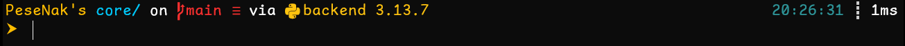
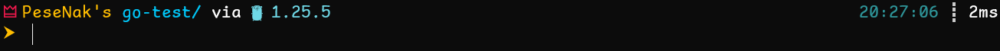

# ThemeAK ـ Oh My Posh Theme

A clean and minimal **Oh My Posh** theme designed for everyday developer workflows.
The theme focuses on clarity, plain styling (no heavy backgrounds), and useful context-aware segments.

## Features

- Admin (elevated shell) indicator
- Git branch and working tree status
- Context-aware language detection:
  - Node.js
  - Python (with virtual environment support)
  - Go
  - Dart / Flutter
- Execution time indicator
- Current time display
- Clean, distraction-free prompt layout

## Preview





## Requirements

- [Oh My Posh](https://ohmyposh.dev/)
- A Nerd Font (recommended):
  - Cascadia Code Nerd Font
  - JetBrainsMono Nerd Font
  - ComicShannsMono Nerd Font (used in preview)

## Installation

### PowerShell (Windows)

```powershell
oh-my-posh init pwsh --config path\to\themeAK.omp.json | Invoke-Expression
```

> Replace `path\to\themeAK.omp.json` with the actual path to the theme file.

To make it persistent, add the command above to your PowerShell profile.

### Other shells

For Bash, Zsh, and other shells, refer to the official documentation:
https://ohmyposh.dev/docs/installation

## Behavior Notes

- Language segments appear only when a relevant project is detected.
- Python is shown when a virtual environment is active.
- The theme is intentionally minimal to avoid unnecessary visual noise.

## Credits

Inspired by the [di4am0nd](https://github.com/JanDeDobbeleer/oh-my-posh/blob/main/themes/di4am0nd.omp.json) theme from the Oh My Posh community.

## License

MIT License
